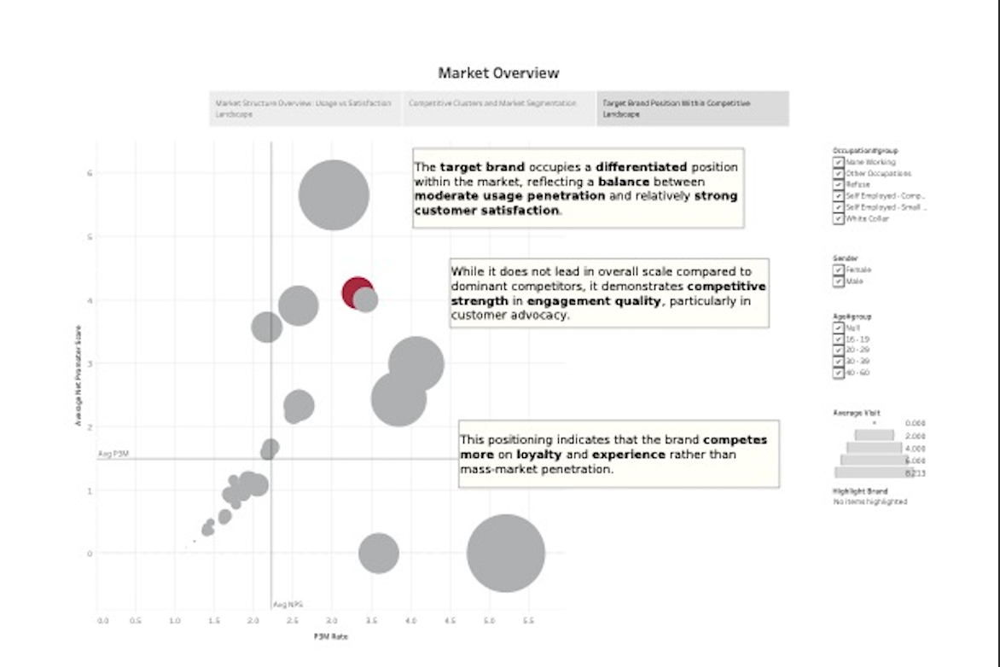

# Ngan Vu — Portfolio

**Applied Mathematics & Quantitative Economics @ University of South Florida**  
Expected Graduation: May 2027 · GPA: 3.94/4.00

📍 Tampa, FL · 📧 nganvtt.0110@gmail.com · [LinkedIn](https://linkedin.com/in/erenevu) · [GitHub](https://github.com/erenengan)

---

## About

As a kid, I used to spend hours working through number sequences - not because anyone asked me to, but because I genuinely couldn't let go until I found the pattern. That curiosity never left. It just grew up and found a more interesting playground.  

I'm an Applied Mathematics and Quantitative Economics student at USF, and the way I see it, data is knowledge. Numbers are never just numbers — they're patterns, signals, stories waiting to be read. In finance and business especially, data can reflect the health of an entire system, reveal subtle anomalies before anyone notices, or quietly confirm that something is off long before it becomes obvious. That's what excites me most: using rigorous quantitative methods to surface the things that aren't immediately visible.  

I'm deeply detail-oriented and take pride in getting things right, not just getting them done. I learn fastest when I'm challenged — I actively seek out feedback and treat every critique as a chance to improve. Staying current matters to me too; I make a habit of continuously updating my skills and keeping up with new tools and methods.

---

## Experience

### Data Analyst Intern · Vietnam National University – HONEYNET Jsc.
*May 2025 – Aug 2025 · Ho Chi Minh City, Vietnam*

- Automated competitor analysis across 50+ real estate platforms using Selenium and Playwright, cutting manual research effort by **80%** and generating an estimated **$5,000 in cost savings**
- Built Tableau dashboards and database schemas improving accessibility for 15+ stakeholders, boosting efficiency by **25%**
- Normalized 2M+ records using R (tidyr, dplyr) to improve data pipeline performance

### Mathematical Finance Division · Private Equity & Venture Capital Club, USF
*Jan 2026 – Present · Tampa, FL*

- Applying linear algebra, stochastic processes, and probability to trading strategies using Python (NumPy, Pandas, SciPy, yfinance)

### Quantitative Analyst · Investment Club, USF
*Jan 2024 – May 2024 · Tampa, FL*

- Improved trade signal accuracy by **20%** via backtesting a Python-based strategy combining RSI and Bollinger Bands for trend reversal detection
- Conducted market research across macroeconomics, equities, fixed income, and commodities to identify trading opportunities

---

## Projects

### Customer Churn Analysis

End-to-end churn analytics pipeline containerized via Docker with SQL ingestion, cleaning, and feature encoding. Built a multi-model classification system using Logistic Regression, Random Forest, and Neural Networks — achieving **99% ROC-AUC**. Delivered executive dashboards in Tableau covering Brand Health and churn summaries.

---

### Portfolio Optimization

Built a full portfolio optimization pipeline on real-world equities — from Yahoo Finance ingestion to Mean-Variance Optimization benchmarked with Sharpe Ratio, Sortino Ratio, and Maximum Drawdown. Simulated **10,000 randomized allocations** via Monte Carlo to map the Efficient Frontier. Optimized portfolios across target return thresholds of 15%–40%.

---

### Fraud Detection

Built an end-to-end fraud detection pipeline on real-world payment transaction data, tackling class imbalance with SMOTE oversampling and stratified splits. Trained and compared Logistic Regression, Random Forest, XGBoost, and a Voting Ensemble, evaluating each on ROC AUC, PR AUC, F1, and Precision/Recall — metrics chosen specifically for imbalanced fraud datasets. EDA surfaced fraud patterns by transaction category and gender prior to modeling.

---

### Women's Education Analysis

Investigated the relationship between female educational attainment and national well-being across multiple countries using ARIMAX time series models and panel data analysis. Applied missForest imputation for missing data integrity, conducted Augmented Dickey-Fuller stationarity tests, and built cross-country visualizations with ggplot2. Found a **statistically significant positive effect** of women's education on well-being measures, with regional variation in key drivers and long-term upward trends tied to higher female education participation.

---

### Hotel Price Analysis — Booking.com

Scraped hotel listings from Booking.com using Selenium, then analyzed how location, customer ratings, and amenities influence pricing in a major city. Built a regression model to predict hotel prices from key features, with EDA and visualizations surfacing the strongest pricing drivers.

---

## Skills

**Languages & Libraries**  
Python (NumPy, Pandas, Matplotlib, Seaborn, Scikit-learn, SciPy, Plotly, yfinance, skfolio, XGBoost, imbalanced-learn) · R (tidyverse, ggplot2, plotly, dplyr, tidyr, missForest, tseries, forecast) · SQL

**Tools**  
Tableau · SQL Server · Excel · Docker · Selenium · Beautiful Soup · Jupyter Notebook

**Methods**  
Machine Learning · Statistical Analysis · Data Visualization · Web Scraping · Neural Networks · Time Series · ARIMAX · Monte Carlo Simulation · SMOTE · Panel Data Analysis

---

## Education

**University of South Florida** — B.S. Applied Mathematics, Quantitative Economics  
*Expected May 2027 · Tampa, FL*

Relevant coursework: Machine Learning · Data Science · Applied Statistics · Time Series · Multivariate Statistical Methods

Programs & Recognition: O4U Engineering Attendee · Goldman Sachs Virtual Insight Series · IYMC Bronze Honor ·  WorldQuant University Data Science Lab · 1st Place KPMG US Case Competition · Dean's List

---

*Open to internship and research opportunities in quantitative finance, data science, and ML engineering.*
